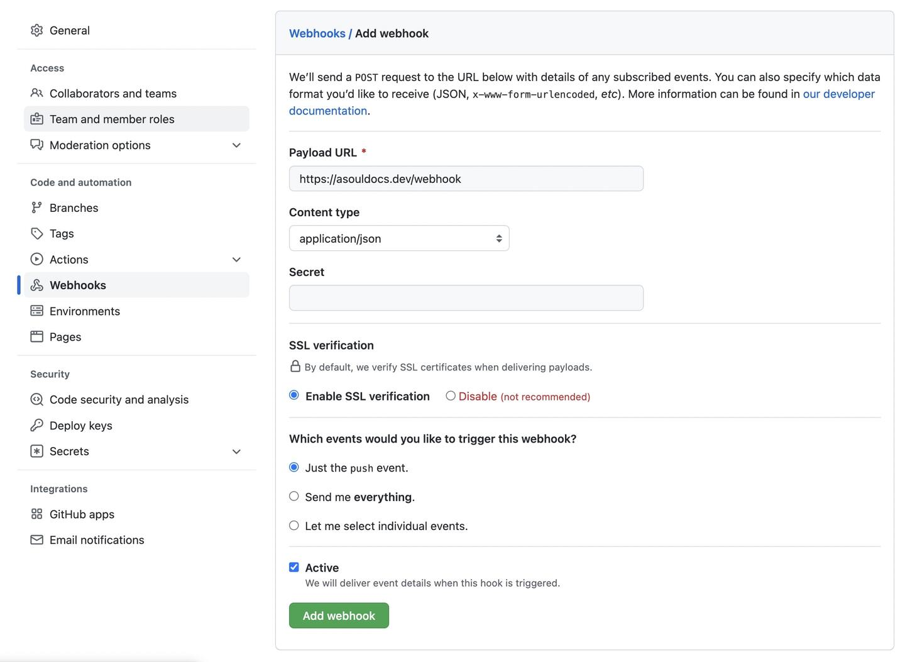

# Hello

[md link test](local_development.md)

[sdg](./local_development.md)




[our dir md test](../zh-CN/howto/configure-reverse-proxy.md)


> bbb

```go
print "Hello"
```
## Two

### Three

#### four
 
##### Five